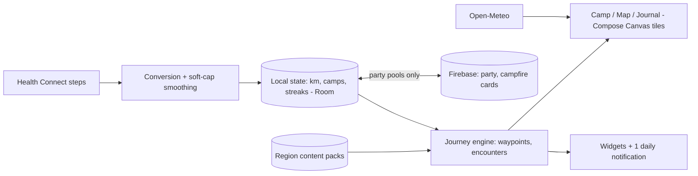

# Rucksack — every step is a step somewhere

Fitness apps count your steps and show you a bar chart, as if a number ever made anyone lace up their shoes. Rucksack gives your steps somewhere to go. Every real-world kilometer you walk moves a small hooded wanderer across a hand-drawn fantasy continent — through the Reedlands, over the Sighing Pass, toward a city on a mountain that is 3,500 kilometers from where you started and genuinely, finally reachable. You camp where your feet stop. You meet who your streaks earn. The map is finite, authored, and has an ending — because a journey that never ends isn't a journey, it's a treadmill, and you already have one of those apps.

## 1. Overview
- **Elevator pitch:** A walking RPG where real steps (via Health Connect) translate 1:1 into kilometers across an authored 3,500 km fantasy continent with regions, characters, storylines and an actual ending. Gear and cosmetics are earned only by walking; friends pool kilometers in guild treks to cross legendary passes. A fitness tracker with a narrative spine instead of a guilt dashboard.
- **Category:** Health & Fitness / Casual RPG hybrid.
- **Tagline:** *Every step is a step somewhere.*
- **Play Store positioning:** "Walk 3,500 real kilometers. Finish an epic. Your body is the controller."

## 2. Problem & Why Now
Step counters have a meaning problem: the number resets at midnight, the goal is arbitrary, and the feedback is a chart — no wonder engagement decays in weeks. Gamified walkers exist and prove enormous demand — Pokémon GO (walking as hunting), Zombies, Run! (walking as story radio), Walkr/Wokamon (steps as idle-game fuel) — but each has a gap: GO requires live outdoor play sessions; Zombies, Run! is audio-first and session-based; the idle games are meaningless cookie-clickers wearing a pedometer. Nobody has built the obvious thing: *persistent passive distance with an authored destination.* Why now: **Health Connect** finally unified Android step data (Fit's API sunset pushed every OEM onto it), meaning reliable background step totals without battery-hungry foreground tracking; and the "quiet quitting of fitness apps" discourse plus the rucking/walking boom (walking is the one fitness trend that survived every cycle) leaves a mass audience wanting exactly this dose: meaning without a workout plan.

## 3. Target Audience & Personas
- **Hana, 33, translator, Osaka.** 6,000 steps/day commuter. Has uninstalled four fitness apps. Downloads Rucksack because a friend's guild needed a fourth for the Sighing Pass. Eight months later she takes the long way home on purpose, because her wanderer is 40 km from the Lantern Coast and she wants to arrive on a weekend morning with coffee.
- **Derek, 47, warehouse manager, Leeds.** 14,000 steps/day at work that count for nothing in his head. Rucksack converts his shifts into progress; he finishes the continent in 11 months and buys the sequel region day one. The "your job walked you across the Reedlands" reframe is why he shows coworkers.
- **Ava & Sam, 26 & 28, couple, Denver.** Use the duo trek to walk the continent together on separate schedules — pooled kilometers for pass-crossings, separate wanderers otherwise. Their camp reunion moments are screenshot fodder.

## 4. Core Concept Deep-Dive
**The continent is the content.** Elsewhere — the landmass — is a single hand-drawn map, 3,500 km of walking route through eleven regions: the Reedlands' windmills and river ferries, the Salt Road's caravan culture, the Sighing Pass where the mountain "decides if it knows you," the drowned bell-towers of Lake Ithra, the Lantern Coast, and finally Cael-on-the-Mountain, the city at journey's end. The route is authored like a book: pacing varies (dense encounter clusters, then deliberate quiet stretches), regions have moods, and the whole thing is walkable in 9–18 months at ordinary human volumes (5–10k steps/day). Finiteness is the sacred design choice: an ending gives every day's steps *narrative gravity* and gives the product its one-sentence pitch. (Business reality: finished walkers buy new continents — see Monetization — the model of a book series, not a subscription hamster wheel.)

**Steps become distance honestly.** Health Connect totals convert at a flat, legible rate (1,300 steps ≈ 1 km, tuned so an average commuter makes visible daily progress). The app never runs GPS, never needs to be opened to count (Health Connect backfills), and says both facts loudly. Anti-cheat is proportion, not policing: daily conversion soft-caps at 40 km (walking marathons count; car phones mostly don't) with gentle smoothing, because the stakes are cosmetic and the tone is trust.

**Camps are the ritual surface.** Wherever your distance runs out today, your wanderer makes camp — and the camp screen is the app's daily reward: a painted vignette of *this specific spot* (the route has 700+ hand-placed camp illustrations blended from region assets), the fire lit, today's kilometers written in the journal, and sometimes company: a tinker whose cart threw a wheel, a pilgrim walking the opposite way, a dog that follows you for three days if you walk all three (the dog is permanent if you earn him; the dog is named Biscuit; Biscuit is the app's most marketable asset).

**Encounters and storylines** are walk-gated, not tap-gated. Characters recur across regions (the pilgrim you met in week two reappears at the Pass in month four, and remembers you); micro-stories resolve over real days ("meet me at the ferry in 30 km") turning the week into an appointment with a fiction. Writing is warm, terse, Ghibli-not-grimdark. There is no combat — the antagonist is distance, weather is drama enough, and this choice widens the audience to everyone who's ever liked a journey story.

**Streaks are gear, not guilt.** Consecutive-day walking forges gear: a 7-day streak weaves the Reed Cloak (cosmetic + journal flourish), 30 days earns the Far-Lantern. Breaking a streak never removes anything — gear is *forged*, not rented. Rest is modeled: two "hearth days" a week bank automatically; the app's tone treats rest as part of walking, which is both kind and true.

**Guild treks** are the social spine: 2–8 friends form a party whose *pooled* kilometers open legendary detours no soloist can reasonably reach (the Sighing Pass wants 400 km in 14 days from the party). Everyone walks their own body; the mountain counts the sum. Weekly "campfire" recap cards (everyone's contribution as flames around one fire — never a leaderboard ladder) keep it cooperative, not competitive; the design goal is group chats saying "big walk tomorrow, we're 60 short," which is retention no notification can buy.

## 5. Complete Feature Set
**MVP (v1.0):**
- Health Connect integration with backfill, flat conversion, soft-cap smoothing; onboarding fallback to device step sensor where HC absent.
- The continent, regions 1–6 (≈2,000 km), 400+ camp vignettes, 30+ recurring characters, journal (auto-written travelogue of days, distances, encounters — exportable as text).
- Camp screen daily ritual; weather synced to real local weather for camp ambience.
- Streak-forged gear (12 items), wanderer cosmetics, Biscuit.
- Guild treks v1: parties up to 8, two legendary detours, campfire weekly cards.
- Widgets: map-progress widget ("14 km to the ferry") and camp widget.
**v1.x fast-follows:**
- Regions 7–11 + the ending of Elsewhere (the arrival at Cael is a designed 20-minute emotional payoff, not a popup).
- Duo trek mode (couples/pairs pooling with shared camp scenes); postcards (share cards of camp vignettes with your stats).
- Seasonal weeks: the Kite Festival crosses whatever region you're in (live-ops sized for solo dev: 3 art assets + 1 encounter chain, quarterly).
**v2.0+:**
- Second continent (paid expansion, "The Archipelago" — ferries, islands, 2,800 km).
- New-game+ pilgrim mode (walk Elsewhere again with your gear, meeting your past camps as "old fire rings").
- Community cartography: opt-in heat-orbs showing where the world's walkers are on the map today (ambient togetherness, zero social feed).

## 6. Screen-by-Screen UX Walkthrough
Navigation: bottom bar — **Camp**, **Map**, **Journal**, **Party**, **Pack** (gear/cosmetics).
- **Camp (home):** today's painted camp, fire, weather; today/total km; the day's encounter if one triggered; "break camp" morning animation when new distance arrives. Opening the app at 7am after yesterday's walk shows the wanderer *already having moved* — progress happened without you, which is the entire thesis rendered as a screen.
- **Map:** the full continent, pinch-zoom from cloud-height to path-level; your route line inked behind you; upcoming waypoints ("Ferry at Ash Ford — 11 km"); locked regions under cartographer's fog; guild detours marked with party sigils.
- **Journal:** auto-travelogue pages ("Day 43 — 8.2 km. Rain over the Reedlands. The tinker's wheel is fixed; she gave you a brass button."), streak-forge progress, stats told as story (total km, days walked, longest day).
- **Party:** guild roster, the pooled meter for the active detour, campfire cards archive, invite via link/QR.
- **Pack:** wanderer dress-up, gear cabinet with forge-dates, Biscuit's page (yes, a full page).
- **Settings:** Health Connect status/permissions plainly explained, conversion rate disclosure, notification preferences (default: max 1/day, the morning camp report; everything else opt-in).
**Key flow — onboarding:** logo-free cold open on the map zooming from clouds to a road → "Everything on this map is walked. 3,500 km. There's an ending." → Health Connect permission with honest copy ("we read steps; we never track location") → name your wanderer → first camp is placed → yesterday's steps (backfilled) already move you 4 km → first encounter (the tinker) triggers at km 5, i.e., most users meet her on day one. Time-to-meaning: one screen after permissions.
**Key flow — the pass with a party:** friend taps invite link → joins party mid-trek → pooled meter jumps → push (opt-in party channel): "Rin joined. 62 km to the Sighing Pass window." → weekend group-chat mobilization → success card: the party silhouetted on the pass, each name a flame. Screenshot rate on this card is a tracked KPI, because it *is* the marketing.

## 7. Design Language
Hand-drawn cartographic warmth: ink-line and watercolor-wash map (the aesthetic of a beloved endpaper map), painted camp vignettes with strong light moods; the wanderer small on purpose — the world carries scale. Type: a humanist serif with cartographic italics (Alegreya) for journal and place-names, clean sans for UI numbers. Motion: slow pans, cloud-parallax on the map, the fire's flicker as the app's heartbeat; nothing urgent ever animates. Sound: one region-flavored ambient loop per area, fire crackle at camp, a soft two-note "arrival" motif; all optional. Haptics: a single warm pulse on arrival at waypoints. The app must feel like a storybook that happens to know your pedometer.

## 8. Technical Architecture
Opinionated stack: **Kotlin + Jetpack Compose** with the map as a custom Compose Canvas tile renderer (pre-rendered ink-map tiles at 4 zoom levels shipped/streamed as region packs; no map SDK — this is an illustration, not GIS). Steps: **Health Connect** `StepsRecord` aggregate reads on a WorkManager cadence + on-open reconciliation; conversion, caps and smoothing are pure functions over daily totals (deterministic replay from HC history makes state self-healing — same pattern as save restore). Content: regions, encounters, characters and camp vignettes ship as versioned packs (regions 7–11 arrive without app-store friction). Backend: **Firebase** — Auth (anonymous default), Firestore for party/pool state and campfire cards, Remote Config for live-ops weeks, Crashlytics; solo-walker mode is fully offline. Real-weather: Open-Meteo daily, coarse location optional (manual region fallback keeps the no-location promise available).

## 9. Data Model
- **Wanderer:** `id`, `name`, `km_total`, `route_position`, `region_id`, `streak{current, hearth_days_banked}`, `gear[]`, `cosmetics[]`, `biscuit:bool`.
- **DailyLedger:** `date`, `steps_raw`, `km_converted`, `capped:bool`, `camp_id`, `weather`.
- **Camp (content):** `id`, `route_km`, `vignette_ref`, `region`, `encounter_table_ref?`.
- **Encounter (content):** `id`, `character_id`, `trigger{km|streak|party}`, `script_ref`, `followup{km_delta, encounter_id}?`.
- **Character (content):** `id`, `name`, `region_arc[]`, `memory_flags[]`.
- **Party:** `id`, `member_ids[]`, `active_detour_id?`, `pool_km`, `window{start,end}`, `campfire_cards[]`.
- **GearItem (content):** `id`, `forge_rule{streak_days}`, `art_ref`, `journal_flourish`.
- **JournalEntry (derived):** `date`, `prose` (template-composed), `km`, `encounter_refs[]`.

## 10. Monetization
Premium journey model — pay for the book, not the treadmill. **Free:** regions 1–2 (≈500 km — two-plus months of ordinary walking, a real experience with the tinker arc and first gear), solo + party features intact. **The Whole Road — one-time $9.99** (₹499; regional tiers): regions 3–11, the ending, duo treks, all gear/cosmetic lines, seasonal weeks. **Expansion continents — $7.99 each** (The Archipelago, yearly cadence). Cosmetic packs ($1.99–2.99, art-only, never distance-affecting) as gentle extra margin. Hard pledges, printed in the store listing: no subscription, no ads, no step-boosters for money (selling distance would burn the product's soul; the community must police this line and will). Conversion logic: the region-2 gate lands at the Salt Road's cliff-edge with the pass visible ahead — a narrative cliffhanger reached *by walking 500 km*, i.e., the most invested possible moment; comparable premium-content walkers (Zombies, Run! legacy pricing) and the 4–8% conversion of strongly free-metered narrative games bound the target: 6% of gate-reachers, who by definition are month-2+ retained users. Finishers' expansion attach target: 35%.

## 11. Play Store Listing
- **Title (≤30):** `Rucksack: The Walking Journey` (28)
- **Short description (≤80):** `Your real steps cross a hand-drawn world. 3,500 km. An actual ending.` (69)
- **Full description:** open with the bar-chart indictment; blocks: A Continent, Not a Counter (the authored world), It Counts While You Live (Health Connect, no GPS, no opening the app), Camp Every Night (the ritual), Walk With Friends (guild treks), Earned, Never Bought (gear pledge + no-booster pledge). Close with Biscuit. Seriously — a screenshot caption: "You will meet a dog. He can be yours forever. It takes three days of walking."
- **ASO keywords:** walking game, step counter game, walking rpg, step tracker adventure, pedometer game, walk to mordor style, fitness rpg, health connect game, walking motivation app, walking challenge with friends.
- **Content rating:** Everyone.
- **Policy notes:** Health Connect data use must follow Play's health-data policy — declare read-steps purpose, no sharing, no ads use of health data (there are no ads); the store listing must not make fitness-outcome claims (motivation framing, not weight-loss); location is optional/coarse for weather only and the listing says so.

## 12. Growth & Marketing Plan
(1) The screenshot loop: camp vignettes and pass-success cards are designed as shareable art (postcards feature, tasteful stat footer) — walking communities on Reddit (r/walking, r/Stepbet refugees, One Punch/Conqueror-challenge crowds) reliably repost this genre. (2) The Conqueror-challenge adjacency: paid virtual walking challenges (medals for walking "to Mordor") have a proven seven-figure market with a weak app layer — Rucksack's launch content markets directly into those communities as "the version with a soul, one price, no medal spam." (3) Creators: seed walking/rucking YouTubers and "cozy game" streamers (an unusual overlap that doubles reach); the finite-ending hook gives creators a natural series arc ("walking across Elsewhere, month 3"). (4) January + Steptember campaigns; workplace-wellness inbound (guilds are accidentally perfect for office step challenges — a landing page, not a sales team, in year one). (5) The ending as an event: first-finishers get an in-app "founders' fire ring" at Cael visible to later arrivals — legend-building that costs one asset. Built-in loops: party invite links (the only invite mechanic), postcards, and the group-chat mobilization dynamics of pooled detours.

## 13. Analytics & KPIs
North star: **median daily steps of week-8 retained users vs their week-1 baseline** (target +12% — the app must actually move bodies, and this number is the soul-metric) alongside **D60 retention ≥ 15%**. Key events: `hc_permission_granted`, `first_encounter`, `camp_opened{streak}`, `gate_reached`, `whole_road_purchased`, `party_created/joined`, `detour_succeeded{party_size}`, `postcard_shared`, `region_entered{n}`, `journey_finished`, `expansion_purchased`. Thresholds: HC grant ≥ 75% of installs; D1 ≥ 45% (camp ritual lands or nothing else matters); gate-reacher conversion ≥ 6%; party participation among D30 users ≥ 25%; success-card share ≥ 15% of detour completions; step-lift +12% sustained without daily-notification count increases (lift must come from meaning, not nagging — audited quarterly).

## 14. Risks & Mitigations
- **Health Connect fragmentation/OEM quirks:** reconciliation-on-open heals gaps (deterministic replay); a visible "step ledger" screen shows exactly what was read and when, converting confusion into trust; device-sensor fallback path maintained.
- **Content pipeline vs. solo dev (700 vignettes!):** vignettes are composed from region asset kits (backgrounds × weather × props) with ~80 fully bespoke hero camps; the journal's prose is template-composed with hand-written highlights; budget one contract illustrator (~$8k) as the largest non-dev cost.
- **Walkers finish and leave:** by design — finishing well creates the series customer (expansion attach is the metric); pilgrim mode and community cartography give finishers ambient presence.
- **Cheating (phone on the dog, step spoofers):** soft caps, no PvP stakes, cosmetic-only rewards; the design removes the incentive rather than fighting the arms race.
- **Sedentary-user alienation (3,500 km sounds mocking):** onboarding frames pace honestly ("most walkers take a year; the road doesn't mind"); accessibility setting converts wheelchair pushes/active minutes via Health Connect equivalents — inclusion handled as route-worthy movement, not an asterisk.
- **Play health-data policy drift:** health data used solely on-device for gameplay; no third-party sharing; re-audit each policy update.

## 15. Competitive Landscape
- **Zombies, Run! (and its Marvel Move era):** narrative fitness's proof of life; session-based audio runs vs Rucksack's passive persistent world — different daily contract, overlapping audience, instructive subscription fatigue in its reviews.
- **The Conqueror Virtual Challenges:** paid per-challenge virtual distances with physical medals; validates "real km → fictional route" demand at scale; weak app experience, no narrative, no characters — Rucksack is the product-first answer.
- **Pokémon GO / Pikmin Bloom:** giants that made walking gameplay normal; require active play sessions and live locations; Rucksack positions as the introvert's walking game — no going anywhere specific, no being anywhere at a time.
- **Walkr / Wokamon / step-idle games:** meaning-free step conversion with heavy IAP; they prove the passive mechanic retains, and their reviews ("wish it went somewhere") are Rucksack's copywriting.
- **Fantasy Hike / WalkToMordor-likes:** small indie attempts at exactly this shape — validating demand, under-executed (static maps, no encounters, no social); Rucksack out-crafts them with authored content and guild mechanics.

## 16. Development Plan
Solo dev + contract illustrator, ~30 weeks to v1.0. W1–3: Health Connect pipeline + deterministic ledger; step-to-km feel-tuning with 10 testers' real data. W4–6: map tile renderer + route engine; region 1 greybox with placeholder art. W7–10: camp system, journal composer, encounter engine, the tinker arc end-to-end — **kill criterion:** if day-3 testers don't open the app unprompted in the morning, the camp ritual isn't landing; redesign before scaling content. W11–16: regions 2–6 content production line (kits, vignettes, arcs); gear forge; Biscuit. W17–19: parties + pooled detours + campfire cards (Firebase). W20–22: widgets, weather, postcards, IAP gate placement. W23–26: closed beta, 300 walkers, 6 weeks of real step data; tune caps, pacing, notification restraint. W27–29: store assets, trailer (map zoom → camps montage → the pass card), creator seeding. W30: launch. Regions 7–11 + the ending ship as v1.x within 4 months (finishers of free+paid content won't reach km 2,000 before then; the schedule races its fastest walkers, tracked weekly). **If behind:** cut duo mode and seasonal weeks; compress regions 5–6; never cut Health Connect reconciliation, the camp ritual, or party pooling.

## 17. Moonshots
- **Real-trail twinning:** licensed real-route continents (the Camino, the Shikoku 88, the Pennine Way) with cultural notes — finish the virtual Camino, get the pilgrim's credential discount with tourism-board partners.
- **The Atlas of Everyone:** an annual rendered film of the year's collective walking (opt-in) — "humanity walked to the sun and back 40 times in Elsewhere this year."
- **Audio camp tales:** commissioned 3-minute fireside stories unlocked by arrival, read by warm famous voices — the podcast budget as content moat.
- **Rucksack Jr.:** a family mode where kids' school walks feed a shared family caravan (COPPA/Families-program compliant build, separate SKU).
- **The physical journal:** print-on-demand clothbound travelogue of your crossing — your journal prose, your camps, your dates; the finisher's object, sibling to Sentence's hardback.
